# Arquitectura del Backend SAC

## 1. Visión General del Proyecto

El **SAC Backend** (Sistema de Administración de Contribuyentes) es una aplicación backend desarrollada en **TypeScript** utilizando el framework **Express.js**. Su propósito principal es gestionar la administración de contribuyentes fiscales, incluyendo el registro, seguimiento de pagos, reportes de IVA e ISLR, y gestión de eventos fiscales.

### 1.1 Propósito del Sistema

El sistema está diseñado para:
- **Gestionar contribuyentes** (taxpayers): Registro, actualización, eliminación y consulta de contribuyentes fiscales.
- **Controlar eventos fiscales**: Multas, advertencias y compromisos de pago.
- **Generar reportes**: Reportes de IVA, ISLR, índices de cumplimiento, KPIs y rendimiento fiscal.
- **Administrar usuarios**: Autenticación, autorización basada en roles y gestión de equipos de fiscales.
- **Manejar censos**: Registro de contribuyentes pendientes de inclusión en el sistema.

### 1.2 Tecnología Principal

| Tecnología | Propósito |
|------------|-----------|
| **Express.js** | Framework web para APIs REST |
| **TypeScript** | Lenguaje tipado para mayor seguridad y mantenibilidad |
| **Prisma ORM** | Acceso a la base de datos MySQL con transacciones |
| **MySQL** | Base de datos relacional principal |
| **tsyringe** | Inyección de dependencias |
| **JWT** | Autenticación basada en tokens |
| **Winston + BetterStack** | Logging estructurado |
| **AWS S3** | Almacenamiento de archivos (PDFs, imágenes) |
| **Resend** | Servicio de envío de correos electrónicos |
| **Zod** | Validación de esquemas y variables de entorno |
| **xlsx** | Generación de archivos Excel |
| **Vitest** | Framework de testing |

---

## 2. Arquitectura de Capas

El proyecto sigue una **arquitectura de capas** bien definida que promueve la separación de responsabilidades y facilita el mantenimiento:

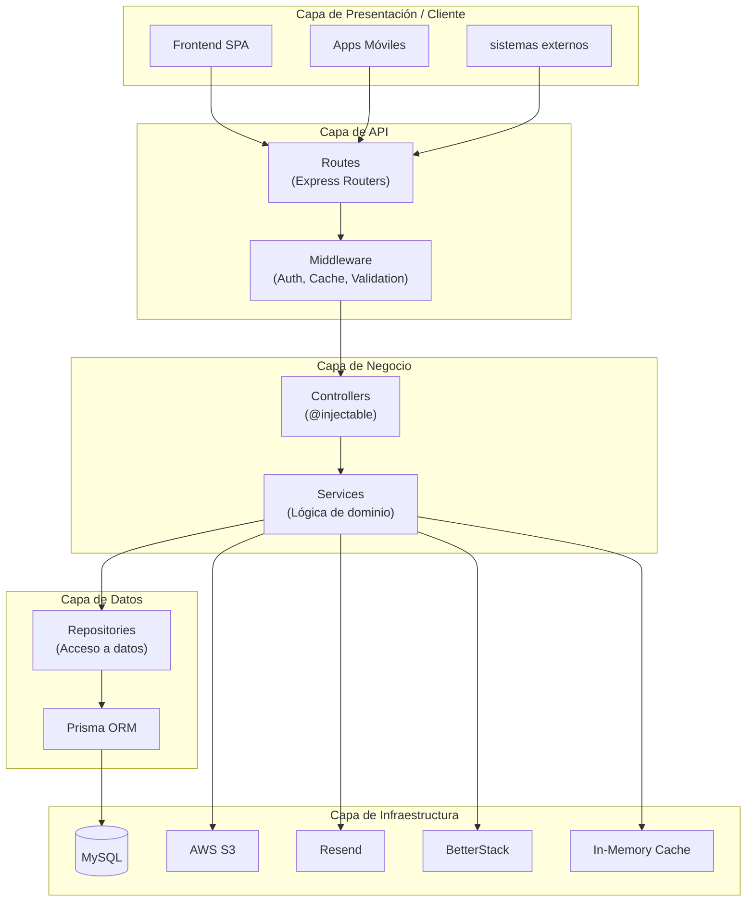

### 2.1 Flujo de Datos Typical

1. **Request** → El cliente envía una petición HTTP a las rutas
2. **Middleware** → Se ejecutan middlewares de autenticación, validación, caché
3. **Controller** → El controlador recibe la petición, valida inputs
4. **Service** → El servicio ejecuta la lógica de negocio
5. **Repository** → El repositorio accede a la base de datos vía Prisma
6. **Response** → La respuesta asciende por las capas de vuelta al cliente

### 2.2 Beneficios de Esta Arquitectura

- **Separación de responsabilidades**: Cada capa tiene un propósito claro
- **Testabilidad**: Los servicios pueden mockear sus dependencias
- **Mantenibilidad**: Cambios en una capa afectan mínimamente a las otras
- **Reusabilidad**: Los servicios pueden ser utilizados por diferentes controladores

---

## 3. Estructura de Directorios

```
src/
├── app.ts                    # Configuración principal de Express
├── index.ts                  # Punto de entrada del servidor
│
├── config/                   # Configuración global
│   ├── env-config.ts         # Variables de entorno con Zod
│   └── features-flags.ts     # Feature flags del sistema
│
├── core/                     # Nucleo compartido
│   └── errors/               # Jerarquía de errores
│       ├── BaseError.ts
│       ├── BadRequestError.ts
│       ├── NotFoundError.ts
│       ├── UnauthorizedError.ts
│       ├── ForbiddenError.ts
│       └── ConflictError.ts
│
├── utils/                    # Utilidades globales
│   ├── container.ts         # Contenedor DI (tsyringe)
│   ├── cache-service.ts     # Servicio de caché en memoria
│   ├── db-server.ts         # Cliente Prisma
│   ├── error-handler.ts     # Manejador global de errores
│   ├── logger.ts            # Winston logger
│   ├── cache-middleware.ts  # Middleware de caché
│   ├── cache-invalidation.ts # Invalidación de caché
│   ├── request-id.ts        # Correlación de requests
│   ├── request-logger.ts    # Logging de requests
│   ├── bigint-serializer.ts # Serializador de BigInt
│   └── s3-client.ts        # Cliente AWS S3
│
├── services/                # Servicios transversales
│   ├── EmailService.ts      # Envío de correos (Resend)
│   └── StorageService.ts    # Almacenamiento (S3)
│
├── users/                   # Módulo de usuarios
│   ├── user-routes.ts       # Rutas de usuarios
│   ├── user-services.ts    # Servicios de usuario
│   ├── UserController.ts    # Controlador
│   ├── UserService.ts       # Servicio principal
│   ├── user-utils.ts        # Utilidades (JWT, auth)
│   ├── dtos/                # DTOs de usuario
│   └── role-strategies/    # Estrategia de roles (Strategy Pattern)
│
├── taxpayer/                # Módulo de contribuyentes
│   ├── taxpayer-routes.ts  # Rutas de contribuyentes
│   ├── taxpayer-services.ts # Servicios
│   ├── TaxpayerController.ts # Controlador
│   ├── TaxpayerService.ts  # Servicio principal
│   ├── taxpayer-utils.ts   # Tipos y utilería
│   ├── dto/                # DTOs de contribuyente
│   ├── interfaces/         # Interfaces (Repository pattern)
│   ├── repository/         # Implementación de repositorios
│   ├── helpers/            # Helpers de dominio
│   └── services/          # Servicios específicos del dominio
│       ├── taxpayer-crud.service.ts
│       ├── event.service.ts
│       ├── payment.service.ts
│       ├── iva-report.service.ts
│       ├── islr-report.service.ts
│       ├── index-iva.service.ts
│       ├── notification.service.ts
│       ├── pdf.service.ts
│       ├── observation.service.ts
│       ├── taxpayer-queries.service.ts
│       └── ...
│
├── reports/                # Módulo de reportes
│   ├── reports-routes.ts  # Rutas de reportes
│   ├── reports-services.ts # Servicios
│   ├── IvaReportService.ts
│   ├── IslrReportService.ts
│   ├── ExcelHelper.ts
│   └── services/          # Servicios especializados de reportes
│       ├── kpi-report.service.ts
│       ├── fiscal-performance.service.ts
│       ├── group-record.service.ts
│       ├── history-report.service.ts
│       └── ...
│
├── census/                 # Módulo de censos
│   ├── census-routes.ts
│   ├── census-services.ts
│   └── census-utils.ts
│
└── __tests__/             # Tests de integración
    ├── setup.ts
    ├── core/
    ├── users/
    ├── taxpayer/
    └── reports/
```

### 3.1 Principios de Organización

- **Barrel Exports**: Cada módulo tiene un archivo `index.ts` que re-exporta todos los servicios públicos
- **Servicios Especializados**: Cada dominio tiene múltiples servicios pequeños en lugar de un monolito
- **Patrón Repository**: Las interfaces definen contratos para acceso a datos
- **Feature Flags**: Permite activar/desactivar funcionalidades sin deployment

---

## 4. Patrones de Diseño Utilizados

### 4.1 Patrón Repository

El proyecto implementa el **Repository Pattern** para separar la lógica de acceso a datos de la lógica de negocio:

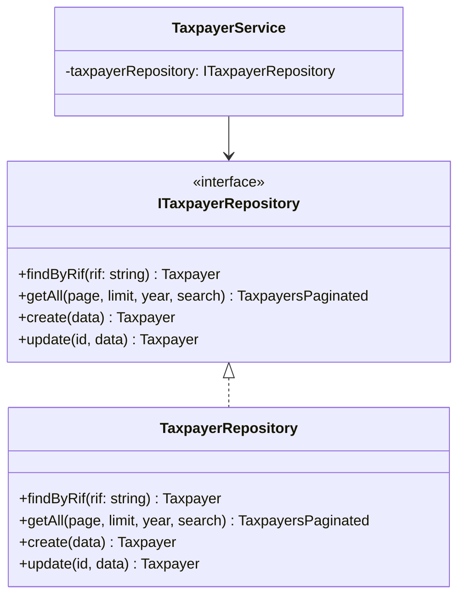

**¿Por qué?**
- Permite hacer **mocks** en tests unitarios
- Facilita cambiar la implementación de base de datos
- Centraliza consultas complejas en un solo lugar

**Ejemplo de interfaz** ([`ITaxpayerRepository.ts`](src/taxpayer/interfaces/ITaxpayerRepository.ts:41)):
```typescript
export const TAXPAYER_REPOSITORY_TOKEN = Symbol.for("ITaxpayerRepository");

export interface ITaxpayerRepository {
    findByRif(rif: string): Promise<Taxpayer | null>;
    getAll(page: number, limit: number, year?: number, search?: string): Promise<TaxpayersPaginated>;
    create(data: CreateTaxpayerData): Promise<Taxpayer>;
    update(id: string, data: Partial<UpdateTaxpayerData>): Promise<Taxpayer>;
}
```

### 4.2 Patrón Strategy (Control de Acceso Basado en Roles)

El proyecto implementa el **Strategy Pattern** para manejar permisos por rol:

```mermaid
classDiagram
    class RoleStrategy {
        <<interface>>
        +role: string
        +getTaxpayerVisibilityWhere(client, userId) taxpayerWhereInput
        +canAccessTaxpayer(client, userId, taxpayerId) {allowed, reason}
    }

    class AdminStrategy {
        +role = "ADMIN"
        +getTaxpayerVisibilityWhere()
        +canAccessTaxpayer()
    }

    class FiscalStrategy {
        +role = "FISCAL"
        +getTaxpayerVisibilityWhere()
        +canAccessTaxpayer()
    }

    class CoordinatorStrategy {
        +role = "COORDINATOR"
        +getTaxpayerVisibilityWhere()
        +canAccessTaxpayer()
    }

    class SupervisorStrategy {
        +role = "SUPERVISOR"
        +getTaxpayerVisibilityWhere()
        +canAccessTaxpayer()
    }

    RoleStrategy <|.. AdminStrategy
    RoleStrategy <|.. FiscalStrategy
    RoleStrategy <|.. CoordinatorStrategy
    RoleStrategy <|.. SupervisorStrategy
```

**Roles definidos** ([`schema.prisma`](prisma/schema.prisma:383)):
- **ADMIN**: Acceso completo al sistema
- **FISCAL**: Gestiona sus propios contribuyentes asignados
- **COORDINATOR**: Coordina un grupo de fiscales
- **SUPERVISOR**: Supervisa fiscales y sus actividades

### 4.3 Inyección de Dependencias (DI)

El proyecto usa **tsyringe** para la inyección de dependencias:

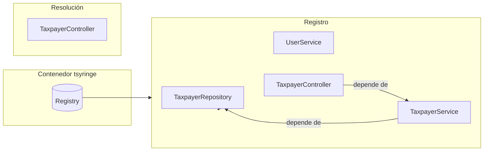

**Configuración** ([`container.ts`](src/utils/container.ts:15)):
```typescript
export function configureContainer(): void {
    container.register(TAXPAYER_REPOSITORY_TOKEN, { useClass: TaxpayerRepository });
    container.registerSingleton(TaxpayerService, TaxpayerService);
    container.registerSingleton(UserService, UserService);
    container.registerSingleton(TaxpayerController, TaxpayerController);
    container.registerSingleton(UserController, UserController);
}
```

### 4.4 Feature Flags

El sistema implementa **Feature Flags** para rollout gradual de funcionalidades:

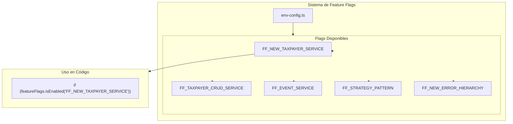

**Ubicación**: [`src/config/features-flags.ts`](src/config/features-flags.ts:17)

---

## 5. Sistema de Caché

El proyecto implementa un **servicio de caché en memoria** robusto:

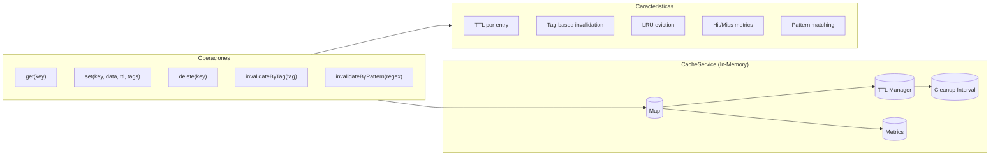

### 5.1 Características del Caché

| Característica | Descripción |
|---------------|-------------|
| **TTL configurable** | Cada entrada puede tener su propio tiempo de vida |
| **Invalidación por tags** | Elimina todas las entradas con una etiqueta específica |
| **Patrones regex** | Invalidación por patrón de clave |
| **LRU Eviction** | Elimina el 10% más antiguo al alcanzar el límite |
| **Métricas** | Hits, misses, evictions, hit rate |

### 5.2 Configuración

**Ubicación**: [`src/utils/cache-service.ts`](src/utils/cache-service.ts:49)

```typescript
private readonly DEFAULT_TTL = 5 * 60 * 1000;  // 5 minutos
private readonly CLEANUP_INTERVAL = 60 * 1000; // 1 minuto
private readonly MAX_CACHE_SIZE = 10000;       // 10,000 entradas
```

---

## 6. Manejo de Errores

El proyecto implementa una **jerarquía de errores** basada en `BaseError`:

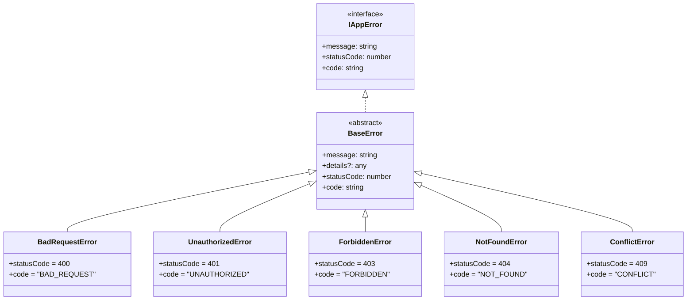

**Ubicación**: [`src/core/errors/`](src/core/errors/)

### 6.1 Manejador Global de Errores

El middleware [`error-handler.ts`](src/utils/error-handler.ts:43) maneja:
- Errores de JSON malformado (400)
- Payload demasiado grande (413)
- Errores de Prisma (códigos P*)
- Errores de aplicación (BaseError)
- Errores genéricos no manejados (500)

---

## 7. Modelo de Datos

El esquema de base de datos está definido en Prisma:

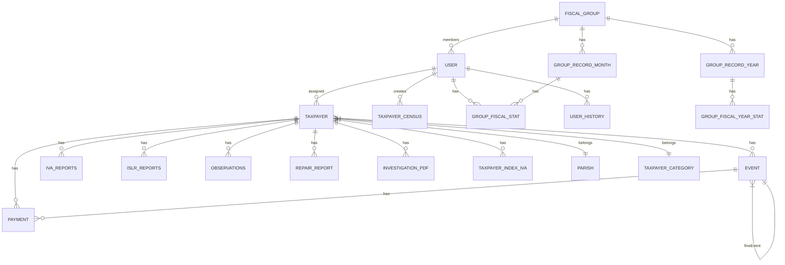

### 7.1 Entidades Principales

| Entidad | Descripción |
|---------|-------------|
| **user** | Usuarios del sistema (fiscales, administradores) |
| **taxpayer** | Contribuyentes fiscales |
| **event** | Eventos fiscales (multas, advertencias) |
| **payment** | Pagos realizados |
| **IVAReports** | Reportes de IVA |
| **ISLRReports** | Reportes de ISLR |
| **FiscalGroup** | Grupos de trabajo de fiscales |
| **TaxpayerCensus** | Census de contribuyentes |
| **UserHistory** | Historial de usuarios por año |

### 7.2 Enums Definidos

```prisma
enum taxpayer_process { FP, AF, VDF, NA }
enum event_type { FINE, WARNING, PAYMENT_COMPROMISE }
enum taxpayer_contract_type { SPECIAL, ORDINARY }
enum user_roles { FISCAL, ADMIN, COORDINATOR, SUPERVISOR }
enum Taxpayer_Fases { FASE_1, FASE_2, FASE_3, FASE_4 }
```

---

## 8. Autenticación y Autorización

### 8.1 Flujo de Autenticación JWT

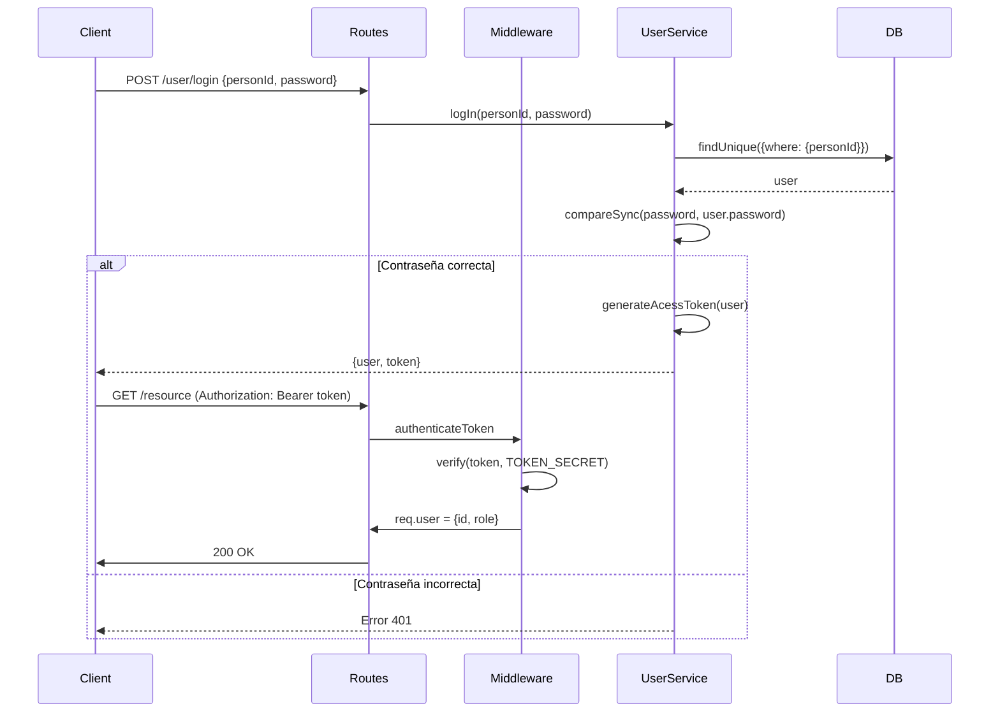

### 8.2 Estructura del Token

```typescript
// Payload del JWT
{
    type: "ADMIN" | "FISCAL" | "COORDINATOR" | "SUPERVISOR",
    user: "uuid-del-usuario"
}
```

---

## 9. Middlewares de Aplicación

El archivo [`app.ts`](src/app.ts) configura múltiples middlewares en orden:

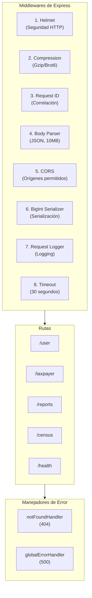

### 9.1 Middlewares Clave

| Middleware | Propósito |
|-----------|-----------|
| **helmet** | Headers de seguridad HTTP |
| **compression** | Compresión de respuestas |
| **requestIdMiddleware** | Asigna UUID a cada request |
| **authenticateToken** | Valida JWT |
| **cacheMiddleware** | Caché de respuestas |
| **globalErrorHandler** | Manejo centralizado de errores |

---

## 10. Servicios Transversales

### 10.1 Email Service

**Ubicaciones**:  
- [`src/services/EmailService.ts`](src/services/EmailService.ts) — envío de correos generales vía **Resend** (notificaciones de contribuyentes, etc.).  
- [`src/services/MailService.ts`](src/services/MailService.ts) — flujo de **recuperación de contraseña** vía **SMTP Gmail + Nodemailer**.

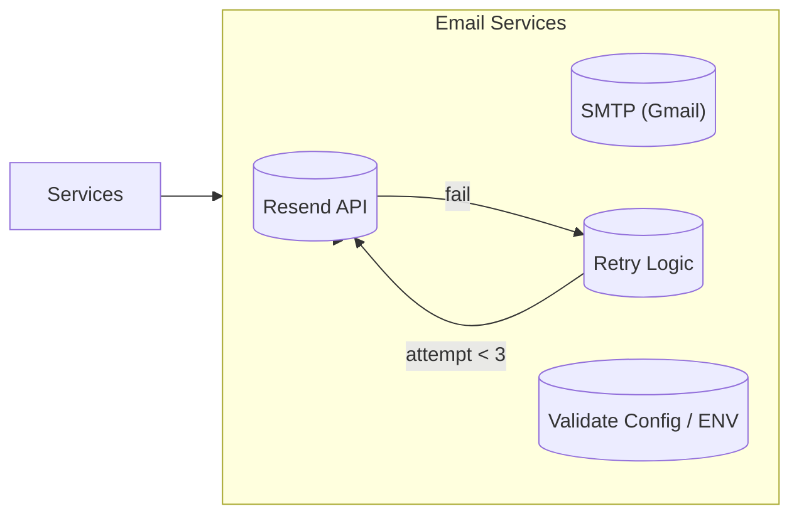

- `EmailService` usa **Resend** como proveedor principal para notificaciones de negocio.
- `MailService` usa **nodemailer** con **SMTP Gmail** para el flujo de **reset de contraseña**, utilizando:
  - `SMTP_USER`, `SMTP_PASS` (contraseña de aplicación).
  - `APP_BASE_URL` para construir los links de recuperación (`/reset-password?token=...`).
- El correo de reset muestra un HTML profesional con botón de acción y aviso de expiración a los **60 minutos**.

> **TODO (pendiente migración BD – asignar a compañero backend):** ejecutar migración Prisma para los campos `resetToken` y `resetTokenExpires` del modelo `user`, ya definidos en `schema.prisma` pero aún no aplicados en MySQL.

### 10.2 Storage Service

**Ubicación**: [`src/services/StorageService.ts`](src/services/StorageService.ts:1)

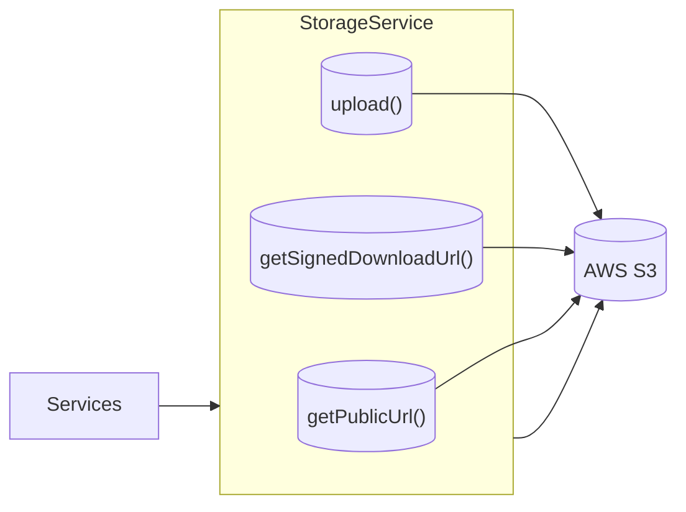

- Usa **AWS S3** para almacenamiento
- Genera URLs firmadas para descargas
- Proporciona URLs públicas para acceso directo

---

## 11. Configuración de Variables de Entorno

### 11.1 Esquema de Validación

El proyecto usa **Zod** para validar variables de entorno:

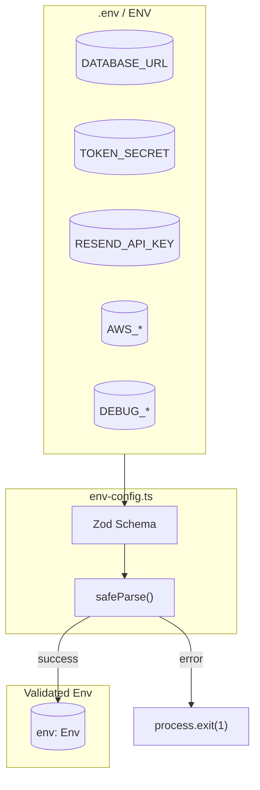

**Ubicación**: [`src/config/env-config.ts`](src/config/env-config.ts:8)

### 11.2 Variables Principales

```typescript
const envSchema = z.object({
  // Database
  DATABASE_URL: z.string().url(),
  NODE_ENV: z.enum(['development', 'staging', 'production', 'test']),
  PORT: z.coerce.number().default(3000),

  // Auth
  TOKEN_SECRET: z.string().min(10),

  // Email
  EMAIL_FROM: z.string().email().optional(),
  RESEND_API_KEY: z.string().optional(),

  // AWS
  AWS_ACCESS_KEY_ID: z.string().optional(),
  AWS_SECRET_ACCESS_KEY: z.string().optional(),
  AWS_REGION: z.string().default('us-east-1'),

  // Feature Flags
  FF_*: z.coerce.string().transform(v => v === 'true').default(false),
});
```

---

## 12. Endpoints Principales

### 12.1 Módulo de Usuarios

| Método | Endpoint | Descripción |
|--------|----------|-------------|
| POST | `/user/login` | Iniciar sesión |
| POST | `/user/signup` | Crear usuario |
| GET | `/user` | Listar usuarios |
| GET | `/user/:id` | Obtener usuario |
| PUT | `/user/:id` | Actualizar usuario |
| DELETE | `/user/:id` | Eliminar usuario |

### 12.2 Módulo de Contribuyentes

| Método | Endpoint | Descripción |
|--------|----------|-------------|
| GET | `/taxpayer` | Listar contribuyentes |
| GET | `/taxpayer/:id` | Obtener contribuyente |
| POST | `/taxpayer` | Crear contribuyente |
| PUT | `/taxpayer/:id` | Actualizar contribuyente |
| DELETE | `/taxpayer/:id` | Eliminar contribuyente |
| GET | `/taxpayer/:id/events` | Obtener eventos |
| POST | `/taxpayer/:id/events` | Crear evento |
| POST | `/taxpayer/:id/payments` | Registrar pago |

### 12.3 Módulo de Reportes

| Método | Endpoint | Descripción |
|--------|----------|-------------|
| GET | `/reports/iva` | Reporte de IVA |
| GET | `/reports/islr` | Reporte de ISLR |
| GET | `/reports/kpi` | KPIs fiscales |
| GET | `/reports/performance` | Rendimiento |
| GET | `/reports/history` | Historial |
| POST | `/reports/errors` | Reportar error |

### 12.4 Módulo de Censos

| Método | Endpoint | Descripción |
|--------|----------|-------------|
| GET | `/census` | Listar census |
| POST | `/census` | Crear entrada de census |
| PUT | `/census/:id` | Actualizar census |

---

## 13. Testing

El proyecto utiliza **Vitest** para testing:

```mermaid
flowchart TB
    subgraph TestFramework["Vitest"]
        Config["vitest.config.ts"]
        Mocks["vitest-mock-extended"]
    end

    subgraph TestStructure["Estructura de Tests"]
        Setup["__tests__/setup.ts"]
        Unit["Tests Unitarios"]
        Integration["Tests de Integración"]
    end

    subgraph Coverage["Cobertura"]
        Coverage["@vitest/coverage-v8"]
    end

    TestFramework --> TestStructure
    TestStructure --> Coverage
```

**Comandos**:
```bash
npm test              # Ejecutar tests
npm run test:watch   # Modo watch
npm run test:coverage # Con cobertura
```

---

## 14. Deployment

### 14.1 Entornos Soportados

| Entorno | Configuración |
|---------|---------------|
| **Development** | `NODE_ENV=development` - Logs detallados |
| **Staging** | Pruebas pre-producción |
| **Production** | `NODE_ENV=production` - Logs mínimos |
| **Test** | `NODE_ENV=test` - Base de datos de prueba |

### 14.2 Production Stack

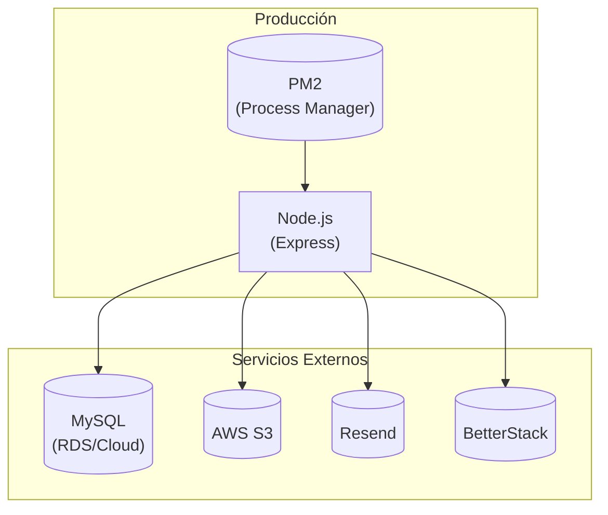

### 14.3 PM2 Configuration

**Archivo**: [`ecosystem.config.js`](ecosystem.config.js)

---

## 15. Decisiones Arquitectónicas Clave

### 15.1 ¿Por qué TypeScript?

- **Tipado estático**: Reduce errores en tiempo de ejecución
- **Autocompletado**: Mejor experiencia de desarrollo
- **Refactoring seguro**: Cambios con confianza

### 15.2 ¿Por qué Prisma?

- **Type-safety**: Generación automática de tipos
- **Migraciones**: Control de versiones de esquema
- **Transacciones**: Soporte nativo
- **Consultas fluidas**: API intuitiva

### 15.3 ¿Por qué tsyringe?

- **Decoradores**: Integración nativa con TypeScript
- **Singleton**: Instancias compartidas por request
- **Tokens**: Inyección por interfaz

### 15.4 ¿Por qué Caché en Memoria?

- **Rápido**: Sin latencia de red
- **Simple**: Sin infraestructura adicional
- **Efectivo**: Reduce carga en BD para datos frecuentes

**Nota**: En arquitecturas con múltiples instancias, considerar Redis.

### 15.5 ¿Por qué Feature Flags?

- **Rollout gradual**: Activar funcionalidades poco a poco
- **Rollback rápido**: Desactivar sin deployment
- **Testing en producción**: Probar con tráfico real

---

## 16. Limitaciones y Consideraciones

### 16.1 Limitaciones Actuales

1. **Caché en memoria**: No funciona en arquitecturas con múltiples instancias
2. **Sin Rate Limiting**: Vulnerable a ataques de fuerza bruta
3. **Sin WebSocket**: Comunicación unidireccional
4. **Base de datos única**: Sin soporte para sharding

### 16.2 Recomendaciones Futuras

1. **Redis**: Para caché distribuido
2. **Rate Limiting**: Implementar con `express-rate-limit`
3. **GraphQL**: Para queries más flexibles
4. **WebSocket**: Para notificaciones en tiempo real
5. **Microservicios**: Para escalar componentes independientes

---

## 17. Glosario de Términos

| Término | Definición |
|---------|------------|
| **Taxpayer** | Contribuyente fiscal (persona o empresa) |
| **Fiscal** | Funcionario que administra contribuyentes |
| **Evento** | Multa, advertencia o compromiso de pago |
| **IVA** | Impuesto al Valor Agregado |
| **ISLR** | Impuesto Sobre la Renta |
| **Census** | Lista de contribuyentes pendientes |
| **Fase** | Estado del proceso de fiscalización (FASE_1 a FASE_4) |
| **RIF** | Registro de Información Fiscal |
| **Providencia** | Número de resolución fiscal |

---

## 18. Referencias

- [Express.js](https://expressjs.com/)
- [Prisma](https://www.prisma.io/)
- [tsyringe](https://github.com/microsoft/tsyringe)
- [JWT](https://jwt.io/)
- [Winston](https://github.com/winston-logs/winston)
- [Vitest](https://vitest.dev/)

---

*Documento generado para el equipo de desarrollo SAC*
*Versión: 1.0.0*
*Fecha: Marzo 2026*
