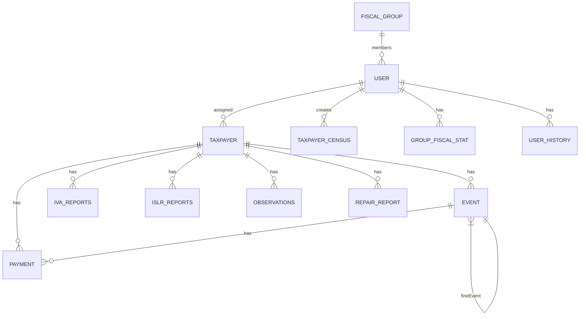

# Explicación Detallada del Proyecto (SAC Backend)

> **Última actualización:** 6 de Marzo de 2026
> **Versión del documento:** 2.0.0

---

## 1. Resumen General del Proyecto

El **SAC Backend** (Sistema de Administración de Contribuyentes) es una aplicación backend desarrollada en **TypeScript** utilizando el framework **Express.js**. Su propósito principal es gestionar de manera integral la administración de contribuyentes fiscales en Venezuela, incluyendo el registro, seguimiento de eventos fiscales, gestión de pagos, y generación de reportes y estadísticas para la toma de decisiones.

### 1.1 Propósito del Sistema

El sistema está diseñado para resolver las siguientes necesidades del negocio:

1. **Gestión de Contribuyentes**: Registro, actualización, eliminación y consulta de contribuyentes fiscales (personas naturales y jurídicas) con sus datos de identificación fiscal (RIF, providencia, categoría económica).

2. **Control de Eventos Fiscales**: Seguimiento de acciones fiscalizadoras incluyendo:
   - **Multas (FINE)**: Sanciones económicas por incumplimiento
   - **Advertencias (WARNING)**: Notificaciones formales de incumplimiento
   - **Compromisos de Pago (PAYMENT_COMPROMISE)**: Acuerdos de pago establecidos con el contribuyente

3. **Gestión de Pagos**: Registro y seguimiento de pagos realizados por los contribuyentes, vinculados a eventos específicos.

4. **Reportes de Impuestos**:
   - **IVA (Impuesto al Valor Agregado)**: Declaración y seguimiento de IVA
   - **ISLR (Impuesto Sobre la Renta)**: Declaración y seguimiento de retenciones

5. **Inteligencia de Negocio**: Generación de KPIs, métricas de rendimiento por fiscal, grupo y global, para evaluar la efectividad de la recaudación fiscal.

### 1.2 Usuarios del Sistema

La aplicación está diseñada para personal con diferentes roles jerárquicos:

| Rol | Descripción | Nivel de Acceso |
|-----|-------------|-----------------|
| **ADMIN** | Administrador del sistema | Completo |
| **COORDINATOR** | Coordinador de grupo de fiscales | Grupo de fiscales |
| **SUPERVISOR** | Supervisor de fiscales | Fiscales supervisados |
| **FISCAL** | Funcionario de campo | Solo sus contribuyentes asignados |

---

## 2. Arquitectura y Diseño

El proyecto sigue una **arquitectura de monolito modular en capas**, un enfoque robusto y mantenible para aplicaciones Express.js.

### 2.1 Diagrama de Arquitectura General

```
┌─────────────────────────────────────────────────────────────────┐
│                        CLIENTE (Frontend)                        │
│   • Frontend SPA (React/Vue)                                    │
│   • Apps Móviles                                                │
│   • Sistemas externos                                           │
└────────────────────────────┬────────────────────────────────────┘
                             │ HTTP/REST
                             ▼
┌─────────────────────────────────────────────────────────────────┐
│                    CAPA DE PRESENTACIÓN                          │
│   • Express Routes (src/*/*.routes.ts)                          │
│   • Middlewares (auth, validation, cache, logging)              │
└────────────────────────────┬────────────────────────────────────┘
                             ▼
┌─────────────────────────────────────────────────────────────────┐
│                    CAPA DE NEGOCIO                              │
│   • Controllers (@injectable)                                   │
│   • Services (lógica de dominio)                                │
└────────────────────────────┬────────────────────────────────────┘
                             ▼
┌─────────────────────────────────────────────────────────────────┐
│                    CAPA DE DATOS                                │
│   • Repositories (interfaces)                                    │
│   • Prisma ORM                                                  │
└────────────────────────────┬────────────────────────────────────┘
                             ▼
┌─────────────────────────────────────────────────────────────────┐
│                    BASE DE DATOS                                │
│   • MySQL                                                       │
└─────────────────────────────────────────────────────────────────┘
```

### 2.2 Componentes Principales

#### Punto de Entrada (`index.ts`)

El archivo [`index.ts`](index.ts) es el punto de entrada principal:

```typescript
// Configuración de variables de entorno
import { env } from "./src/config/env-config";

// Inicialización del servidor
app.listen(PORT, '0.0.0.0', () => {
    logger.info(`[STARTUP] Server is listening on port: ${PORT}`)
})
```

**Funciones:**
- Carga configuración de variables de entorno
- Configura manejo de errores no capturados
- Configura graceful shutdown (SIGTERM, SIGINT)
- Inicia el servidor Express

#### Configuración de Express (`src/app.ts`)

El archivo [`src/app.ts`](src/app.ts) configura todos los middlewares globales:

```typescript
// 1. Seguridad - Helmet
app.use(helmet({ ... }))

// 2. Compresión
app.use(compression())

// 3. Request ID (correlación)
app.use(requestIdMiddleware)

// 4. Body parsing
app.use(express.json({ limit: "10mb" }))

// 5. CORS
app.use(cors({ ... }))

// 6. Serialización de BigInt
app.use(serializeForJson)

// 7. Logging de requests
app.use(requestLogger)

// 8. Timeout (30 segundos)
app.use(timeoutMiddleware)

// 9. Rutas de salud
app.get("/health", ...)

// 10. Rutas de aplicación
app.use("/user", userRouter)
app.use("/taxpayer", taxpayerRouter)
app.use("/reports", reportRouter)
app.use("/census", censusRouter)

// 11. Manejo de errores
app.use(notFoundHandler)
app.use(globalErrorHandler)
```

### 2.3 Estructura de Directorios

```
src/
├── config/                    # Configuración global
│   ├── env-config.ts         # Variables de entorno con Zod
│   └── features-flags.ts     # Feature flags del sistema
│
├── core/                     # Núcleo compartido
│   └── errors/               # Jerarquía de errores
│
├── utils/                    # Utilidades globales
│   ├── container.ts         # Inyección de dependencias
│   ├── cache-service.ts     # Caché en memoria
│   ├── db-server.ts         # Cliente Prisma
│   ├── error-handler.ts     # Manejador global
│   ├── logger.ts            # Winston logger
│   └── ...
│
├── services/                # Servicios transversales
│   ├── EmailService.ts     # Resend
│   └── StorageService.ts    # AWS S3
│
├── users/                   # Módulo de usuarios
├── taxpayer/               # Módulo de contribuyentes
├── reports/                # Módulo de reportes
├── census/                 # Módulo de censos
└── __tests__/              # Tests
```

---

## 3. Tecnologías Utilizadas

### 3.1 Stack Principal

| Tecnología | Propósito | Versión |
|------------|-----------|---------|
| **Express.js** | Framework web para APIs REST | ^4.19.2 |
| **TypeScript** | Lenguaje tipado | ^5.9.3 |
| **Prisma ORM** | Acceso a base de datos MySQL | ^6.19.1 |
| **MySQL** | Base de datos relacional | 8.0+ |
| **tsyringe** | Inyección de dependencias | ^4.10.0 |
| **JWT** | Autenticación basada en tokens | ^9.0.2 |

### 3.2 Librerías Adicionales

| Librería | Propósito |
|----------|-----------|
| **Winston + @logtail** | Logging estructurado |
| **AWS SDK v3** | Almacenamiento en S3 |
| **Resend** | Envío de correos electrónicos |
| **Zod** | Validación de esquemas |
| **xlsx** | Generación de archivos Excel |
| **multer** | Procesamiento de uploads |
| **helmet** | Headers de seguridad |
| **bcryptjs** | Hash de contraseñas |
| **Vitest** | Framework de testing |

### 3.3 Herramientas de Desarrollo

| Herramienta | Propósito |
|-------------|-----------|
| **nodemon** | Recarga automática en desarrollo |
| **tsx** | Ejecución de TypeScript |
| **PM2** | Process manager para producción |
| **Prisma Studio** | UI para base de datos |

---

## 4. Patrones de Diseño Implementados

### 4.1 Patrón Repository

El proyecto implementa el **Repository Pattern** para abstraer el acceso a datos:

```typescript
// Interfaz del repositorio
export interface ITaxpayerRepository {
    findByRif(rif: string): Promise<Taxpayer | null>;
    getAll(page: number, limit: number, year?: number): Promise<TaxpayersPaginated>;
    create(data: CreateTaxpayerData): Promise<Taxpayer>;
    update(id: string, data: Partial<UpdateTaxpayerData>): Promise<Taxpayer>;
}

// Implementación concreta
export class TaxpayerRepository implements ITaxpayerRepository {
    async findByRif(rif: string): Promise<Taxpayer | null> {
        return await db.taxpayer.findUnique({ where: { rif } });
    }
    // ... más métodos
}
```

**Beneficios:**
- Testabilidad (mocks en tests unitarios)
- Abstracción de la implementación de datos
- Mantenibilidad

### 4.2 Patrón Strategy (Control de Acceso)

El sistema implementa **Strategy Pattern** para manejar permisos por rol:

```typescript
// Interfaz de estrategia
export interface RoleStrategy {
    readonly role: string;
    getTaxpayerVisibilityWhere(client: TxClient, userId: string): Promise<Prisma.taxpayerWhereInput>;
    canAccessTaxpayer(client: TxClient, userId: string, taxpayerId: string): Promise<{ allowed: boolean }>;
}

// Estrategias por rol
export class AdminStrategy implements RoleStrategy { ... }
export class FiscalStrategy implements RoleStrategy { ... }
export class CoordinatorStrategy implements RoleStrategy { ... }
export class SupervisorStrategy implements RoleStrategy { ... }
```

**Comportamiento por rol:**

| Rol | Visibilidad de Contribuyentes |
|-----|------------------------------|
| ADMIN | Todos los contribuyentes |
| FISCAL | Solo los asignados a él |
| COORDINATOR | Todos los de su grupo |
| SUPERVISOR | Los de fiscales que supervisa |

### 4.3 Inyección de Dependencias

El proyecto usa **tsyringe** para inyección de dependencias:

```typescript
// Configuración del contenedor
export function configureContainer(): void {
    container.register(TAXPAYER_REPOSITORY_TOKEN, { useClass: TaxpayerRepository });
    container.registerSingleton(TaxpayerService, TaxpayerService);
    container.registerSingleton(UserService, UserService);
    container.registerSingleton(TaxpayerController, TaxpayerController);
}

// Uso en controladores
@injectable()
export class TaxpayerController {
    constructor(
        @inject(TaxpayerService) private taxpayerService: TaxpayerService
    ) {}
}
```

### 4.4 Feature Flags

El sistema implementa **Feature Flags** para rollout gradual:

```typescript
// Activación de funcionalidades
if (featureFlags.isEnabled('FF_STRATEGY_PATTERN')) {
    const strategy = getRoleStrategy(user.role);
    const where = await strategy.getTaxpayerVisibilityWhere(db, user.id);
} else {
    // Legacy logic
}
```

---

## 5. Modelo de Datos

### 5.1 Entidades Principales



### 5.2 Descripción de Entidades

#### Entidad: `user` (Usuario)

| Campo | Tipo | Descripción |
|-------|------|-------------|
| id | UUID | Identificador único |
| name | String | Nombre completo |
| role | Enum | ADMIN, FISCAL, COORDINATOR, SUPERVISOR |
| personId | Int | Cédula de identidad |
| password | String | Hash bcrypt |
| email | String | Correo electrónico |
| groupId | UUID? | Grupo fiscal al que pertenece |
| supervisorId | UUID? | Supervisor asignado |

#### Entidad: `taxpayer` (Contribuyente)

| Campo | Tipo | Descripción |
|-------|------|-------------|
| id | UUID | Identificador único |
| providenceNum | BigInt | Número de providencia |
| rif | String | Registro de Información Fiscal |
| name | String | Nombre del contribuyente |
| process | Enum | FP, AF, VDF, NA |
| contract_type | Enum | SPECIAL, ORDINARY |
| fase | Enum | FASE_1, FASE_2, FASE_3, FASE_4 |
| parish_id | UUID? | Parroquia |
| taxpayer_category_id | UUID? | Categoría económica |

#### Entidad: `event` (Evento Fiscal)

| Campo | Tipo | Descripción |
|-------|------|-------------|
| id | UUID | Identificador único |
| type | Enum | FINE, WARNING, PAYMENT_COMPROMISE |
| amount | Decimal | Monto associated |
| debt | Decimal | Deuda acumulada |
| status | Boolean | Activo/inactivo |
| taxpayerId | UUID | Contribuyente asociado |

#### Entidad: `payment` (Pago)

| Campo | Tipo | Descripción |
|-------|------|-------------|
| id | UUID | Identificador único |
| amount | Decimal | Monto del pago |
| date | DateTime | Fecha del pago |
| eventId | UUID | Evento associated |
| taxpayerId | UUID | Contribuyente |

---

## 6. Rutas de la API

### 6.1 Módulo de Usuarios (`/user`)

| Método | Endpoint | Descripción | Rol Requerido |
|--------|----------|-------------|---------------|
| POST | `/login` | Iniciar sesión | Público |
| POST | `/sign-up` | Crear usuario | ADMIN |
| GET | `/` | Listar usuarios | ADMIN |
| GET | `/me` | Datos del usuario actual | Cualquiera |
| GET | `/all` | Todos los usuarios | ADMIN |
| GET | `/get-fiscals-for-review` | Fiscales para supervisión | SUPERVISOR |
| PUT | `/update-by-name/:name` | Actualizar usuario | ADMIN |
| PATCH | `/update-password/:id` | Cambiar contraseña | Usuario mismo |

### 6.2 Módulo de Contribuyentes (`/taxpayer`)

Este es el módulo más extenso con operaciones CRUD completas:

| Método | Endpoint | Descripción |
|--------|----------|-------------|
| **CRUD Básico** | | |
| POST | `/` | Crear contribuyente |
| GET | `/` | Listar contribuyentes (paginado) |
| GET | `/:id` | Obtener contribuyente |
| PUT | `/:id` | Actualizar contribuyente |
| DELETE | `/:id` | Eliminar contribuyente |
| **Eventos Fiscales** | | |
| POST | `/:id/fine` | Crear multa |
| POST | `/:id/warning` | Crear advertencia |
| POST | `/:id/payment_compromise` | Crear compromiso de pago |
| GET | `/:id/events` | Obtener eventos |
| **Pagos** | | |
| POST | `/payment` | Registrar pago |
| GET | `/:id/payments` | Obtener pagos |
| **Reportes de Impuestos** | | |
| POST | `/createIVA` | Crear declaración de IVA |
| POST | `/create-islr-report` | Crear declaración de ISLR |
| GET | `/:id/iva-reports` | Obtener reportes de IVA |
| GET | `/:id/islr-reports` | Obtener reportes de ISLR |
| **Archivos** | | |
| POST | `/upload-pdf` | Subir PDF (acta de reparo) |
| GET | `/download-repair-report/:key` | Descargar PDF |

### 6.3 Módulo de Censos (`/census`)

| Método | Endpoint | Descripción |
|--------|----------|-------------|
| POST | `/` | Crear registro de censo |
| GET | `/getCensus` | Listar census |
| DELETE | `/:id` | Eliminar registro |

### 6.4 Módulo de Reportes (`/reports`)

Este módulo es el corazón de inteligencia de negocio:

#### Estadísticas Globales

| Método | Endpoint | Descripción |
|--------|----------|-------------|
| GET | `/global-performance` | Resumen de rendimiento general |
| GET | `/global-kpi` | KPIs organizacionales |
| GET | `/global-taxpayer-performance` | Rendimiento de IVA por mes |
| GET | `/get-monthly-growth` | Crecimiento mensual |
| GET | `/get-taxpayers-compliance` | Tasa de cumplimiento |
| GET | `/get-expected-amount` | Recaudación esperada |

#### Estadísticas por Grupo

| Método | Endpoint | Descripción |
|--------|----------|-------------|
| GET | `/fiscal-groups` | Información de grupos |
| GET | `/group-performance` | Métricas por grupo |
| GET | `/get-top-fiscals` | Ranking de fiscales |
| GET | `/get-top-five-by-group` | Top 5 por grupo |
| GET | `/get-best-supervisor-by-group` | Mejor supervisor |

#### Estadísticas por Fiscal

| Método | Endpoint | Descripción |
|--------|----------|-------------|
| GET | `/get-fiscal-info/:id` | Información del fiscal |
| GET | `/get-fiscal-monthly-collect/:id` | Recaudación mensual |
| GET | `/get-fiscal-monthly-performance/:id` | Rendimiento mensual |
| GET | `/get-fiscal-compliance/:id` | Cumplimiento del fiscal |

#### Reportes Especiales

| Método | Endpoint | Descripción |
|--------|----------|-------------|
| GET | `/get-complete-report` | Reporte flexible con filtros |

---

## 7. Lógica de Negocio

### 7.1 Flujo de un Contribuyente

```
┌────────────────┐
│   REGISTRO     │  Creación del contribuyente
│   (CREATE)     │  con datos fiscales básicos
└───────┬────────┘
        │
        ▼
┌────────────────┐
│   ASIGNACIÓN   │  Asignación a un fiscal
│   (ASSIGN)     │  para seguimiento
└───────┬────────┘
        │
        ▼
┌────────────────┐
│   FISCALIZACIÓN│  Proceso de revisión
│   (PROCESS)    │  FP → AF → VDF
└───────┬────────┘
        │
        ▼
┌────────────────┐
│    EVENTOS     │  Multas, Advertencias,
│   (EVENTS)     │  Compromisos
└───────┬────────┘
        │
        ▼
┌────────────────┐
│    PAGOS       │  Liquidación de
│  (PAYMENTS)    │  obligaciones
└───────┬────────┘
        │
        ▼
┌────────────────┐
│   CUMPLIMIENTO │  Finalización del
│   (CULMINATED) │  proceso
└────────────────┘
```

### 7.2 Fases del Proceso Fiscal

| Fase | Descripción | Estado |
|------|-------------|--------|
| **FASE_1** | Inicio del proceso | Activo |
| **FASE_2** | Documentación | En progreso |
| **FASE_3** | Verificación | En progreso |
| **FASE_4** | Resolución | Completado |

### 7.3 Tipos de Contribuyentes

| Tipo | Descripción |
|------|-------------|
| **ORDINARY** | Contribuyentes regulares |
| **SPECIAL** | Contribuyentes especiales (régimen diferenciado) |

### 7.4 Procesos de Fiscalización

| Código | Descripción |
|--------|-------------|
| **FP** | Fiscalización Previa |
| **AF** | Acción Fiscal |
| **VDF** | Verificación de Datos Fiscales |
| **NA** | No Aplica |

---

## 8. Autenticación y Autorización

### 8.1 Flujo de Autenticación JWT

```
1. Usuario envía credenciales
       │
       ▼
2. /user/login valida credenciales
       │
       ├── Error → 401 Unauthorized
       │
       ▼
3. Genera JWT con {user, type}
       │
       ▼
4. Cliente almacena token
       │
       ▼
5. Requests subsecuentes incluyen
   Authorization: Bearer <token>
```

### 8.2 Estructura del Token

```json
{
  "type": "ADMIN|FISCAL|COORDINATOR|SUPERVISOR",
  "user": "uuid-del-usuario",
  "iat": 1234567890,
  "exp": 1234571490
}
```

---

## 9. Servicios de Infraestructura

### 9.1 Caché en Memoria

El sistema implementa un servicio de caché robusto:

```typescript
// Características
- TTL configurable por entrada
- Invalidación por tags
- Invalidación por patrón regex
- LRU eviction (10% al límite)
- Métricas de hits/misses

// Configuración
const DEFAULT_TTL = 5 * 60 * 1000;  // 5 minutos
const MAX_CACHE_SIZE = 10000;        // 10,000 entradas
```

### 9.2 Almacenamiento (AWS S3)

```
Archivos subidos a S3:
├── /errors/          # Imágenes de errores reportados
├── /repair-reports/  # Actas de reparo PDF
└── /investigations/  # PDFs de investigación
```

### 9.3 Correos (Resend)

```
Notificaciones enviadas:
├── Nuevos contribuyentes
├── Recordatorios de pago
└── Alertas de eventos
```

---

## 10. Manejo de Errores

### 10.1 Jerarquía de Errores

```typescript
// Errores base
BaseError
├── BadRequestError      (400)
├── UnauthorizedError    (401)
├── ForbiddenError      (403)
├── NotFoundError       (404)
└── ConflictError       (409)
```

### 10.2 Manejador Global

El middleware [`error-handler.ts`](src/utils/error-handler.ts) maneja:
- Errores de JSON malformado (400)
- Payload demasiado grande (413)
- Errores de Prisma (códigos P*)
- Errores de aplicación (BaseError)
- Errores genéricos (500)

---

## 11. Testing

### 11.1 Framework

- **Vitest**: Framework de testing
- **Supertest**: Testing de endpoints HTTP
- **vitest-mock-extended**: Mocks avanzados

### 11.2 Comandos

```bash
npm test              # Ejecutar tests
npm run test:watch   # Modo watch
npm run test:coverage # Con cobertura
```

---

## 12. Deployment

### 12.1 Entornos

| Entorno | NODE_ENV | Características |
|---------|----------|-----------------|
| Development | development | Logs detallados, hot reload |
| Staging | staging | Pruebas pre-producción |
| Production | production | Logs mínimos, optimización |
| Test | test | Base de datos isolada |

### 12.2 Production Stack

- **PM2**: Process manager
- **MySQL (RDS)**: Base de datos gestionada
- **AWS S3**: Almacenamiento
- **BetterStack**: Logging

---

## 13. Contenido Relacionado

Para más información, consulta:

- **[architecture.md](../architecture.md)**: Documento de arquitectura completa
- **[FEATURE_FLAGS.md](../FEATURE_FLAGS.md)**: Detalle de feature flags
- **[prisma/schema.prisma](../prisma/schema.prisma)**: Esquema de base de datos

---

*Documento actualizado el 6 de Marzo de 2026*
*Versión 2.0.0*
